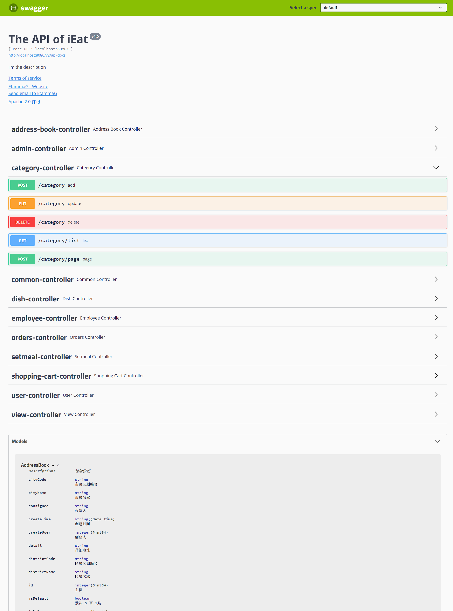

# iEat


## 项目简介

iEat外卖平台的api实现，分为两部分。一为后台管理，功能有：菜品管理（批量删除、起售停售）、套餐管理（修改、起售停售）、订单明细；二为移动端，功能有：个人中心（退出登录、最新订单查询、历史订单、地址管理-修改地址、地址管理-删除地址）、购物车（删除购物车中的商品)

## 项目目录

```
└─src
    ├─main
    │  ├─java
    │  │  └─com
    │  │      └─etammag
    │  │          └─ieat
    │  │              ├─common
    │  │              │  └─utils
    │  │              ├─config
    │  │              ├─controller
    │  │              ├─entity
    │  │              │  ├─details
    │  │              │  └─dto
    │  │              ├─exception
    │  │              │  └─bean
    │  │              ├─filter
    │  │              ├─mapper
    │  │              ├─mbg
    │  │              └─service
    │  │                  ├─details
    │  │                  ├─impl
    │  │                  │  └─sign
    │  │                  └─sign
    │  └─resources
    │      ├─mapper
    │      └─templates
    │          ├─backend
    │          │  ├─api
    │          │  ├─images
    │          │  │  ├─404-images
    │          │  │  ├─icons
    │          │  │  └─login
    │          │  ├─js
    │          │  ├─page
    │          │  │  ├─category
    │          │  │  ├─combo
    │          │  │  ├─food
    │          │  │  ├─login
    │          │  │  ├─member
    │          │  │  └─order
    │          │  ├─plugins
    │          │  │  ├─axios
    │          │  │  ├─element-ui
    │          │  │  │  └─fonts
    │          │  │  └─vue
    │          │  └─styles
    │          │      ├─fonts
    │          │      └─icon
    │          ├─front
    │          │  ├─api
    │          │  ├─fonts
    │          │  ├─images
    │          │  ├─js
    │          │  ├─page
    │          │  └─styles
    │          └─super
    └─test
        └─java
            └─com
                └─etammag
                    └─ieat
```

## 技术选型

| 技术             | 说明                | 官网                                           |
| ---------------- | ------------------- | ---------------------------------------------- |
| SpringBoot       | Web应用开发框架     | https://spring.io/projects/spring-boot         |
| SpringSecurity   | 认证和授权框架      | https://spring.io/projects/spring-security     |
| MyBatis          | ORM框架             | http://www.mybatis.org/mybatis-3/zh/index.html |
| MyBatisGenerator | 数据层代码生成器    | http://www.mybatis.org/generator/index.html    |
| Redis            | 内存数据存储        | https://redis.io/                              |
| Druid            | 数据库连接池        | https://github.com/alibaba/druid               |
| JWT              | JWT登录支持         | https://github.com/jwtk/jjwt                   |
| Lombok           | Java语言增强库      | https://github.com/rzwitserloot/lombok         |
| PageHelper       | MyBatis物理分页插件 | http://git.oschina.net/free/Mybatis_PageHelper |
| Swagger-UI       | API文档生成工具     | https://github.com/swagger-api/swagger-ui      |

## 环境

- JDK17
- MySQL8.0.35
- Redis7.2

MySQL和Redis的服务器地址在 `application.yaml` 中修改


## API详情

启动服务后访问 `http://localhost:8080/swagger-ui.html` 即可查看服务的接口文档



